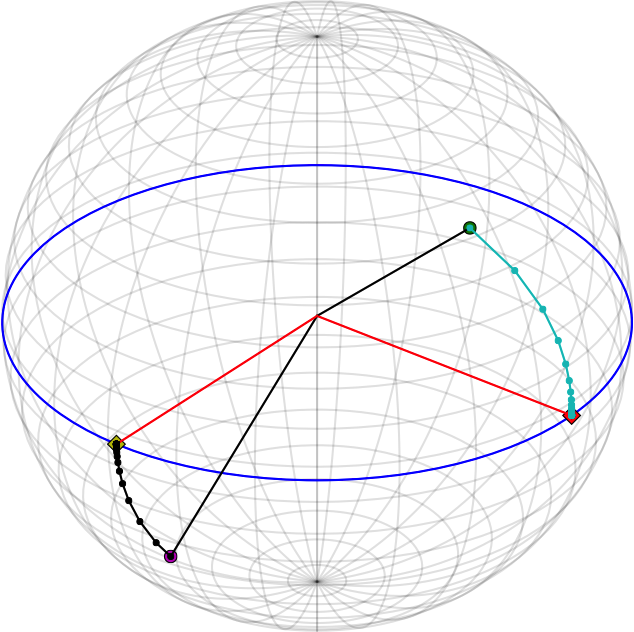
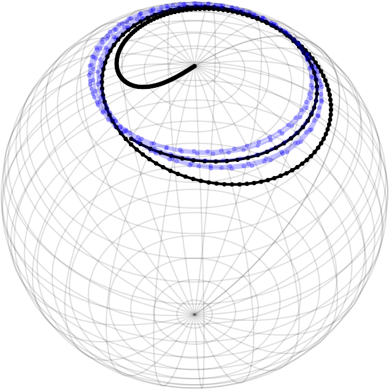
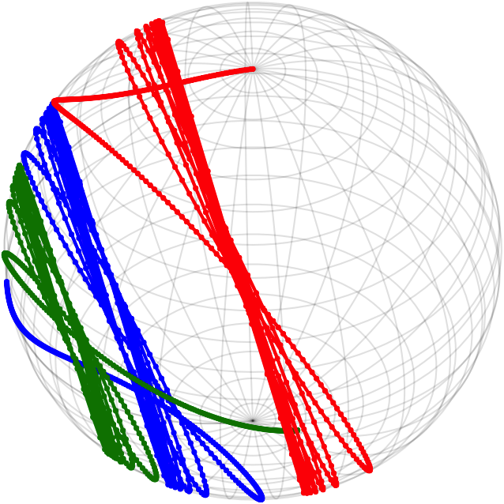
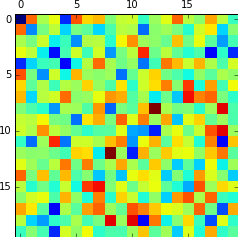
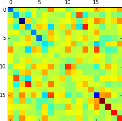

# Integrators on homogeneous spaces

## Purpose

This is a proof-of-concept implementation of the general description of Runge–Kutta on homogeneous spaces, from the paper ["Integrators on homogeneous spaces: Isotropy choice and connections"](http://arxiv.org/abs/1402.6981).

## Installation & Examples

1. Install [`uv`](https://docs.astral.sh/uv/) if you haven't already.
2. Clone this repo
3. Inside the repo, run `uv sync`
4. Run `uv run --group example --with jupyter,"." jupyter lab`
5. Open the jupyter URL in a browser
6. Navigate to the `examples` folder and run the `Demo.ipynb`.

## Gallery
The following pictures are extracted from [this Demo Notebook](https://gist.github.com/olivierverdier/ea449d66f856481fd80ab5aa76bb08c0)

Integration on a Stiefel manifold:

Quadrature on a sphere:

Quadrature on the group SO(3):

Continuous QR flow, converging towards a diagonal matrix:

 

